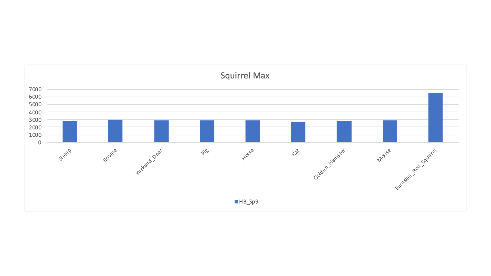

# Mammalian_sperm_PXD003164

---

## Publication Summary

Comparative cross-species proteomics experiments are really nice applications of modern shotgun proteomics methods. Proteomics is really driven by the quality and availability of protein sequence collections. These files in [FASTA format](https://en.wikipedia.org/wiki/FASTA_format) are often called protein databases. If you want some fun on Twitter, raise the question of whether or not such simple files call really be called "databases". The World is full of molehills you should not die on and this is one of those.

Protein FASTA files have many sources (NCBI, Ensembl, UniProt, and many more) and their quality (and completeness) can be variable. Even agreeing on definitions of quality and completeness can be challenging. One thing that is not up for debate (if you still believe in facts and reality) is that we are drowning in protein sequences and we are just getting warmed up. I am sure several new genomes have been sequenced since you started reading this.

You really live in a bubble if you only work on a few of the well-studied model organisms. Things get real real fast when you start running roadkill samples in your core facility. Some fun public data on sperm proteomics can be found in this [2016 publication](https://www.sciencedirect.com/science/article/pii/S1874391915302268?casa_token=U1aH0XaOMrcAAAAA:rBzFrvBJKeuoaxCJ7vI2kJpLiIeIvAzG7u7bnKCEBCRKDuSQv698HvLSbNxOs5_mmRiNnamD):    

> Bayram, H.L., Claydon, A.J., Brownridge, P.J., Hurst, J.L., Mileham, A., Stockley, P., Beynon, R.J. and Hammond, D.E., 2016. Cross-species proteomics in analysis of mammalian sperm proteins. Journal of proteomics, 135, pp.38-50.

The paper describes 30 sperm samples from 19 species that were (run over and then) run on an Thermo LTQ Orbitrap Velos instrument. There were several rodent species and several ungulates (sheep, cows, and pigs in domestic and more wild forms). Tryptic digests were run in 90 minute single shot runs (MS1 scans at high resolution and low resolution CID MS2 scans). Since the paper is now a whole 5 years old, the choices for which FASTA files to use might be rather different.

## Re-analysis Objectives

The first goal has to be to find the gene that makes rodents and ungulates want to cross the road. Ha-ha. I have some tools to make comparing proteomes between species easier described in this [blog post](https://pwilmart.github.io/blog/2019/10/14/orthologs-annotations). The first (poorly formed) idea was that this could be a good dataset to demonstrate those tools.

---

## RAW files

The RAW files are at [PXD003164](https://www.ebi.ac.uk/pride/archive/projects/PXD003164).

RAW No.|RAW Name|MS2 Scans
-------|--------|---------
1|HB_Sp1|13,989
2|HB_Sp2|17,529
3|HB_Sp4|18,384
4|HB_Sp5|14,695
5|HB_Sp6|17,311
6|HB_Sp7|13,796
7|HB_Sp8|15,611
8|HB_Sp9|18,902
9|HB_Sp10|19,972
10|HB_Sp11|17,948
11|HB_Sp12|19,563
12|HB_Sp13|19,551
13|HB_Sp14|19,272
14|HB_Sp15|18,741
15|HB_Sp16|19,392
16|HB_Sp17|19,524
17|HB_Sp18|19,739
18|HB_Sp19|19,502
19|HB_Sp21|18,723
20|HB_Sp22|18,994
21|HB_Sp23|18,135
22|HB_Sp24|17,041
23|HB_Jan14Sp17|18,409
24|HB_Jan14Sp18|20,432
25|HB_Jan14Sp19|18,527
26|HB_Jan14Sp20|17,680
27|HB_Jan14Sp21|17,498
28|HB_Jan14Sp22|18,614
29|HB_Jan14Sp23|20,701
30|HB_Jan14Sp24|18,978

The paper said there were 30 RAW files and that matched what was in the archive project. So far so good. After conversion to MS2 format files, there were 547,153 total MS2 spectra (comma is used as the thousands separator). The RAW filenames do not contain any embedded species information. There was a `Samples_Species.txt` file with a sample key. Also good. Next was a thorough read of the paper to see what database search setting I would need. Details on the species (full latin names or taxonomy numbers) are important when trying to find the appropriate protein FASTA files to use. There are also sample processing details and instrument settings that we need for search engine settings.

Table 1 in the paper lists the 19 species with latin names and the number of samples for each species. The number of samples totaled to 30 (check). The species count was 19. Examination of the `Samples_Species.txt` file from the archive indicated only 14 species. Okay, something is wrong - probably the sample key from the archive. The paper does not map the 19 species to the RAW file names, so we were dead in the water. I sent an email to Dr. Beynon to get clarification on the sample key.

> Quick history of mail using music as an example. We used to send actual pieces of paper with stuff written on them to each other. These were like vinyl records. For a short period of time, some of us had computers that could print stuff on paper. We put that paper in paper envelopes with stamps and sent those for a few years. That is like CDs. Then Al Gore invented the internet, which was a fast way for computers to talk to each other. Early on, we had to use phone modems (another device that needs its own aside) so we could make slow computer connections to the computers with the fast connections. Now we could skip the printer and just send something like a Word processing file to each other. Of course we could not use actual Word processing files, we had special email programs used to compose the messages. This was like [Napster](https://en.wikipedia.org/wiki/Napster) and MP3 music files. We could send crappy communications anywhere on the planet in seconds (or minutes or hours...). This email system has evolved into a very capable and mature technology that is so easy to use that we actively try to avoid using it. This is like high resolution audio. We now have a total hodgepodge of social media related ways to communicate much more poorly that are all the rage. We can type with our thumbs (messaging services), we can type severely limited messages with no ability to edit typos (Twitter), send pictures of written letters (Instagram), or communicate via interpretive dance (TikTok). This newer stuff is like music streaming.

Sample No.|LC_Run|Original PRIDE Key|From Gels PPT
----------|------|------------------|-------------
1|HB_Sp1|Buffalo|Buffalo
2|HB_Sp2|Oryz|Scimitar Horned Oryx
3|HB_Sp4|Ankole|Ankole
4|HB_Sp5|Blackbuck|Blackbuck
5|HB_Sp6|Woodmouse|Woodmouse
6|HB_Sp7|Woodmouse|Woodmouse
7|HB_Sp8|Ankole|Ankole
8|HB_Sp9|Squirrel|Red Squirrel
9|HB_Sp10|Ram|Ram
10|HB_Sp11|Woodmouse|Woodmouse
11|HB_Sp12|Lechwe|Lechwe
12|HB_Sp13|Field Vole|Field Vole
13|HB_Sp14|Field Vole|Field Vole
14|HB_Sp15|Bank Vole|Bank Vole
15|HB_Sp16|Bank Vole|Bank Vole
16|HB_Sp17|Ram|Ram|
17|HB_Sp18|Boar|Boar
18|HB_Sp19|Wild Boar|Wild Boar x
19|HB_Sp21|BN Rat|BN Rat
20|HB_Sp22|BN Rat|BN Rat
21|HB_Sp23|Wistar Rat|Wistar Rat
22|HB_Sp24|Wistar Rat|Wistar Rat
23|HB_Jan14Sp17|Ram|Zebra
24|HB_Jan14Sp18|Boar|Wildebeast
25|HB_Jan14Sp19|Wild Boar|Gemsbok
26|HB_Jan14Sp20|Field Vole|Alfred's Deer
27|HB_Jan14Sp21|BN Rat|Warthog|
28|HB_Jan14Sp22|BN Rat|Ram
29|HB_Jan14Sp23|Wistar Rat|Boar
30|HB_Jan14Sp24|Wistar Rat|Bull

The key from the Powerpoint file has 19 species and they match what is in Table 1 in the paper. The key in the PRIDE archive has only 14 species present. The keys agree except for the last 8 files. We have to sample key choices. What to do? I could flip a coin but I do not have coins in my pockets anymore. The key with 19 species seems more likely. What a conundrum!

Wait a minute. I have the data on my computer. Why not ask the data what species each file is? Is that possible? How would one do that? Here is what I thought. None of the samples are from another commonly studied mammal; namely, humans. Search all of the samples against a canonical human FASTA sequence collection to establish a baseline PSM ID number for each sample. Find an appropriate grid of similar UniProt canonical FASTA sequence collections for as many of the known species as possible and see how the number of PSMs identified at 1% FDR change.

---

## Species Jack-in-the-box

The idea is that if we have a baseline ID number from a related species that is maybe some similar distance from all of the organisms, then, if we stumble upon a really good FASTA collection, the PSM number will jump out at us like a [Jack-in-the-box](https://en.wikipedia.org/wiki/Jack-in-the-box). Where you can find good FASTA sequence collections is a function of time since that species had its genome sequenced. Initially, you have to look at the big [Publisher's Clearing House](https://en.wikipedia.org/wiki/Publishers_Clearing_House) sequence repositories like NCBI. Genomes eventually get processed with pipelines like RefSeq and then migrate to other sources of sequences like Ensembl. Given that Ensembl has a focus on higher eukaryotic species, most of the organisms in this study would be expected to have Ensembl collections. UniProt is a little different in that it has many life stages of protein sequence collection under one roof. There are computer processed TrEMBL sequences, manually processed sequences (Sprot or Swiss-Prot), combinations of both (proteomes, reference proteomes, and canonical proteomes - all with or without manually curated isoforms). The canonical collections use ortholog relationships to define about 21 thousand proteins (one for each gene) for each species. My preference is the UniProt canonical FASTA sequence collections.

---

## Database Grid

Here are the databases I found last summer (2020):

Species|Database Source/Type|Version|Proteome/Assembly|Taxon|Sequences|Tryptic Peptides
-------|--------------------|-------|-----------------|-----|---------|----------------
Human|UniProt Canonical Reference|2020.04|UP000005640|9606|20600|2327144
Sheep|UniProt Canonical Reference|2020.04|UP000002356|9940|21217|2253086
Pig|UniProt Canonical Reference|2020.04|UP000008227|9823|22168|2295149
Bovine|UniProt Canonical Reference|2020.05|UP000009136|9913|23846|2327616
Yarkand Deer|Ensembl|v100|CEY_v1|84702|41224|2501626
Horse|UniProt Canonical Reference|2020.05|UP000002281|9796|20866|2415809
Rat|UniProt Canonical Reference|2020.04|UP000002494|10116|21587|2230127
Golden Hamster|UniProt Canonical Reference|2020.05|UP000189706|10036|20469|2269452
Mouse|UniProt Canonical Reference|2020.04|UP000000589|10090|21989|2343477
Eurasian Red Squirrel|Ensembl|v100|mSciVul1.1|55149|33234|2316987
Ensembl_Squirrel|Ensembl|v100|SpeTri2.0|43179|25958|2110951
Artic_Ground_Squirrel|Ensembl|v100|ASM342692v1|9999|30023|2225017
Daurian_Ground_Squirrel|Ensembl|v100|ASM240643v1|99837|27607|1993949
Squirrel|UniProt Canonical Reference|2020.05|UP000005215|43179|18446|2060771
Siberian_Musk_Deer|Ensembl|v100|MosMos_v2_BIUU_UCD|68415|33292|2340600
Deer|UniProt Canonical Reference|2020.05|UP000242450|46360|19236|1467651

We have a good span of organisms with the UniProt canonical sequence collections. We will dig a bit deeper into squirrel and deer later. We can see that the Ensembl sequence collections are larger than the UniProt canonical collections. The have more explicit isoform (alternative slicing) content. We will want a consistent data processing framework to compare the searches against the different databases.

---

## Searching and post processing

I used the [PAW pipeline](https://github.com/pwilmart/PAW_pipeline) that uses the Comet search engine to identify PSMs at a 1% FDR. The major settings were:

* 1.25 Da monoisotopic parent ion mass tolerance
* 1.0005 Da monoisotopic fragment ion mass tolerance
* semi-tryptic cleavage with up to 2 missed cleavages
* reduced and alkylated Cys residues (static modification)
* variable oxidized Met modifications

The FASTA files were varied in a series of searches of the half a million spectra. The target/decoy method was used to filter the PSMs passing 1% FDR cutoffs. The PSM counts for a selection of the FASTA sequence collections is shown below. The RAW file names ate listed along with the two possible sample keys. For each row, the FASTA file that had the highest PSM count (highlighted in bold) is tallied (along with the best rodent or ungulate category guess).

LC_Run|Original PRIDE Key|From Gels PPT|Guess by Max|U or R Guess|Human|Sheep|Pig|Bovine|Yarkand Deer|Horse|Rat|Golden Hamster|Mouse|Eurasian Red Squirrel
------|------------------|---------|------------|------------|-----|-----|---|------|------------|-----|---|--------------|-----|---------------------
HB_Sp1|Buffalo|Buffalo|Bovine|U|*3285*|4172|3270|**4779**|4151|3100|2791|2748|2822|3040
HB_Sp2|Oryz|Scimitar Horned Oryx|Sheep|U|*2705*|**4472**|2866|4442|4158|2588|2304|2296|2312|2589
HB_Sp4|Ankole|Ankole|Yarkand Deer|U|*3878*|5520|4012|5882|**7397**|3734|3271|3227|3331|3569
HB_Sp5|Blackbuck|Blackbuck|Sheep|U|*3287*|**4597**|3288|4529|4371|3147|2674|2660|2739|2957
HB_Sp6|Woodmouse|Woodmouse|Mouse|R|*2262*|2111|2054|2208|2129|1997|3119|2687|**3336**|2253
HB_Sp7|Woodmouse|Woodmouse|Mouse|R|*1997*|1807|1744|1863|1781|1773|2454|2264|**2596**|1904
HB_Sp8|Ankole|Ankole|Bovine|U|2856|*3349*|2389|**4987**|3348|2496|2098|2208|2307|2265
HB_Sp9|Squirrel|Red Squirrel|Red Squirrel|R|*3215*|2842|2925|2962|2904|2936|2746|2816|2879|**6468**
HB_Sp10|Ram|Ram|Sheep|U|*3536*|**7664**|3839|5892|5558|3526|3025|3014|3027|3611
HB_Sp11|Woodmouse|Woodmouse|Mouse|R|*4321*|3855|3786|3987|3873|3857|5152|4750|**5471**|4176
HB_Sp12|Lechwe|Lechwe|Sheep|U|*5081*|**7111**|5051|6883|6711|4834|4224|4247|4333|4635
HB_Sp13|Field Vole|Field Vole|Hamster|R|*3915*|3569|3592|3755|3635|3525|4498|**5004**|4632|3984
HB_Sp14|Field Vole|Field Vole|Hamster|R|*4158*|3739|3699|3919|3774|3678|4680|**5188**|4829|4173
HB_Sp15|Bank Vole|Bank Vole|Hamster|R|*3514*|3156|3202|3338|3222|3112|3992|**4413**|4076|3519
HB_Sp16|Bank Vole|Bank Vole|Hamster|R|*3511*|3193|3186|3373|3235|3094|4047|**4581**|4189|3546
HB_Sp17|Ram|Ram|Sheep|U|*3754*|**7512**|4057|6142|5729|3737|3218|3254|3280|3655
HB_Sp18|Boar|Boar|Pig|U|*3169*|3292|**7041**|3490|3497|3140|2640|2636|2679|3010
HB_Sp19|Wild Boar|Wild Boar x|Pig|U|*3435*|3545|**7322**|3679|3718|3348|2842|2827|2860|3213
HB_Sp21|BN Rat|BN Rat|Rat|R|*3379*|3079|3088|3181|3099|3032|**7085**|3742|4467|3349
HB_Sp22|BN Rat|BN Rat|Rat|R|*3316*|2994|3040|3151|3036|2996|**7197**|3783|4490|3315
HB_Sp23|Wistar Rat|Wistar Rat|Rat|R|*2912*|2692|2704|2861|2727|2660|**6554**|3400|4099|2995
HB_Sp24|Wistar Rat|Wistar Rat|Rat|R|*2853*|2625|2634|2760|2651|2609|**6462**|3286|3979|2904
HB_Jan14Sp17|Ram|Zebra|Horse|U|3664|*3626*|3682|3695|3668|**7364**|3095|3089|3112|3464
HB_Jan14Sp18|Boar|Wildebeast|Sheep|U|*4879*|**7501**|4975|7272|6986|4680|4075|3966|4090|4429
HB_Jan14Sp19|Wild Boar|Gemsbok|Sheep|U|*4699*|**7124**|4929|7008|6676|4557|4030|4019|4030|4432
HB_Jan14Sp20|Field Vole|Alfred's Deer|Yarkand Deer|U|*4519*|6283|4812|6638|**8043**|4453|3980|3954|3993|4320
HB_Jan14Sp21|BN Rat|Warthog|Pig|U|*2837*|2972|**6099**|3124|3111|2799|2372|2377|2419|2690
HB_Jan14Sp22|BN Rat|Ram|Sheep|U|*4202*|**8316**|4541|6695|6369|4141|3644|3687|3680|4076
HB_Jan14Sp23|Wistar Rat|Boar|Pig|U|*3842*|4080|**9052**|4262|4315|3853|3263|3260|3306|3662
HB_Jan14Sp24|Wistar Rat|Bull|Bovine|U|*3985*|6009|4407|**8297**|6100|3935|3468|3474|3514|3870

Generally speaking, the Jack-in-the-box experiment shows that the sample key from the Powerpoint file is more correct than the sample key in the PRIDE archive. `HB_Sp4` suggests that Ankole cattle is not right and this is one of the deers.

---

## PSM ID Charts

---
