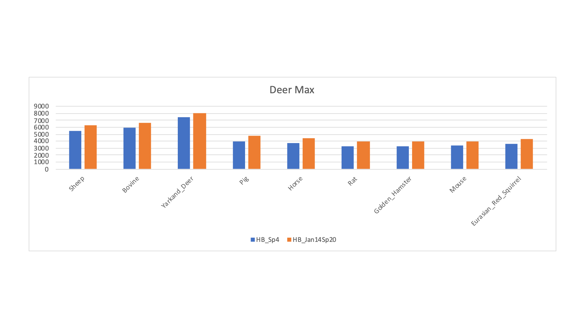
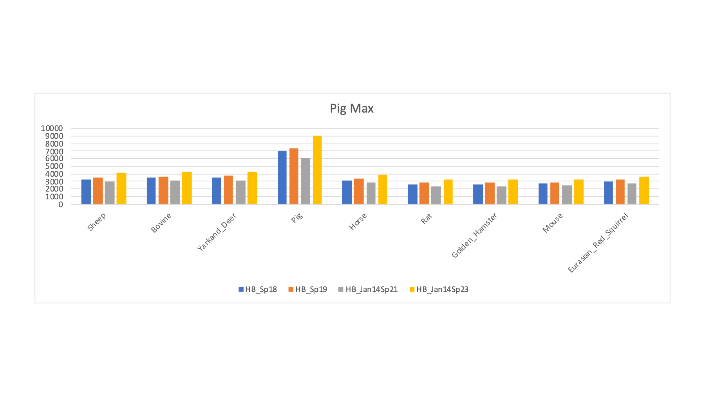
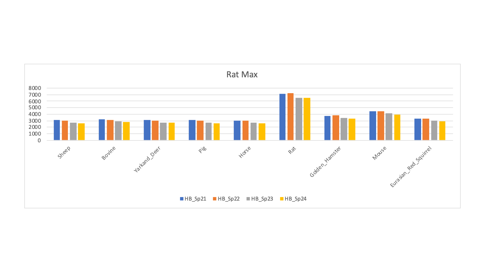

# Mammalian_sperm_PXD003164

---

## Publication Summary

Comparative cross-species proteomics experiments are really nice applications of modern shotgun proteomics methods. Proteomics is really driven by the quality and availability of protein sequence collections. These files in [FASTA format](https://en.wikipedia.org/wiki/FASTA_format) are often called protein databases. If you want some fun on Twitter, raise the question of whether or not such simple files can really be called "databases". The World is full of molehills you should not die on and this is one of those.

Protein FASTA files have many sources (NCBI, Ensembl, UniProt, and many more) and their quality (and completeness) can be variable. Even agreeing on definitions of quality and completeness can be challenging. One thing that is not up for debate (if you still believe in facts and reality) is that we are drowning in protein sequences and we are just getting warmed up. I am sure several new genomes have been sequenced since you started reading this.

You really live in a bubble if you only work on a few of the well-studied model organisms. Things get "real" real fast when you start running roadkill samples in your core facility. Some fun public data on sperm proteomics can be found in this [2016 publication](https://www.sciencedirect.com/science/article/pii/S1874391915302268?casa_token=U1aH0XaOMrcAAAAA:rBzFrvBJKeuoaxCJ7vI2kJpLiIeIvAzG7u7bnKCEBCRKDuSQv698HvLSbNxOs5_mmRiNnamD):    

> Bayram, H.L., Claydon, A.J., Brownridge, P.J., Hurst, J.L., Mileham, A., Stockley, P., Beynon, R.J. and Hammond, D.E., 2016. Cross-species proteomics in analysis of mammalian sperm proteins. Journal of proteomics, 135, pp.38-50.

The paper describes 30 sperm samples from 19 species that were (run over and then) run on an Thermo LTQ Orbitrap Velos instrument. There were several rodent species and several ungulates (sheep, cows, and pigs in domestic and more wild forms). Tryptic digests were run in 90 minute single shot runs (MS1 scans at high resolution and low resolution CID MS2 scans). Since the paper is now a whole 5 years old, the choices for which FASTA files to use might be rather different.

## Re-analysis Objectives

The first goal has to be to find the gene that makes rodents and ungulates want to cross the road. Ha-ha. I have some tools to make comparing proteomes between species easier described in this [blog post](https://pwilmart.github.io/blog/2019/10/14/orthologs-annotations). The first (poorly formed) idea was that this could be a good dataset to demonstrate those tools.

---

## RAW files

The RAW files are at [PXD003164](https://www.ebi.ac.uk/pride/archive/projects/PXD003164).

RAW No.|RAW Name|MS2 Scans
-------|--------|---------
1|HB_Sp1|13,989
2|HB_Sp2|17,529
3|HB_Sp4|18,384
4|HB_Sp5|14,695
5|HB_Sp6|17,311
6|HB_Sp7|13,796
7|HB_Sp8|15,611
8|HB_Sp9|18,902
9|HB_Sp10|19,972
10|HB_Sp11|17,948
11|HB_Sp12|19,563
12|HB_Sp13|19,551
13|HB_Sp14|19,272
14|HB_Sp15|18,741
15|HB_Sp16|19,392
16|HB_Sp17|19,524
17|HB_Sp18|19,739
18|HB_Sp19|19,502
19|HB_Sp21|18,723
20|HB_Sp22|18,994
21|HB_Sp23|18,135
22|HB_Sp24|17,041
23|HB_Jan14Sp17|18,409
24|HB_Jan14Sp18|20,432
25|HB_Jan14Sp19|18,527
26|HB_Jan14Sp20|17,680
27|HB_Jan14Sp21|17,498
28|HB_Jan14Sp22|18,614
29|HB_Jan14Sp23|20,701
30|HB_Jan14Sp24|18,978

The paper said there were 30 RAW files and that matched what was in the archive project. So far so good. After conversion to MS2 format files, there were 547,153 total MS2 spectra (comma is used as the thousands separator). The RAW filenames do not contain any embedded species information. There was a `Samples_Species.txt` file with a sample key. Also good. Next was a thorough read of the paper to see what database search setting I would need. Details on the species (full latin names or taxonomy numbers) are important when trying to find the appropriate protein FASTA files to use. There are also sample processing details and instrument settings that we need for search engine settings.

Table 1 in the paper lists the 19 species with latin names and the number of samples for each species. The number of samples totaled to 30 (check). The species count was 19. Examination of the `Samples_Species.txt` file from the archive indicated only 14 species. Okay, something is wrong - probably the sample key from the archive. The paper does not map the 19 species to the RAW file names, so we were dead in the water. I sent an email to Dr. Beynon to get clarification on the sample key.

> Quick history of mail using music as an example. We used to send actual pieces of paper with stuff written on them to each other. These were like vinyl records. For a short period of time, some of us had computers that could print stuff on paper. We put that paper in paper envelopes with stamps and sent those for a few years. That is like CDs. Then Al Gore invented the internet, which was a fast way for computers to talk to each other. Early on, we had to use phone modems (another device that needs its own aside) so we could make slow computer connections to the computers with the fast connections. Now we could skip the printer and just send something like a Word processing file to each other. Of course we could not use actual Word processing files, we had special email programs used to compose the messages. This was like [Napster](https://en.wikipedia.org/wiki/Napster) and MP3 music files. We could send crappy communications anywhere on the planet in seconds (or minutes or hours...). This email system has evolved into a very capable and mature technology that is so easy to use that we actively try to avoid using it. This is like high resolution audio. We now have a total hodgepodge of social media related ways to communicate much more poorly that are all the rage. We can type with our thumbs (messaging services), we can type severely limited messages with no ability to edit typos (Twitter), send pictures of written letters (Instagram), or communicate via interpretive dance (TikTok). This newer stuff is like music streaming.

Sample No.|LC_Run|Original PRIDE Key|From Gels PPT
----------|------|------------------|-------------
1|HB_Sp1|Buffalo|Buffalo
2|HB_Sp2|Oryz|Scimitar Horned Oryx
3|HB_Sp4|Ankole|Ankole
4|HB_Sp5|Blackbuck|Blackbuck
5|HB_Sp6|Woodmouse|Woodmouse
6|HB_Sp7|Woodmouse|Woodmouse
7|HB_Sp8|Ankole|Ankole
8|HB_Sp9|Squirrel|Red Squirrel
9|HB_Sp10|Ram|Ram
10|HB_Sp11|Woodmouse|Woodmouse
11|HB_Sp12|Lechwe|Lechwe
12|HB_Sp13|Field Vole|Field Vole
13|HB_Sp14|Field Vole|Field Vole
14|HB_Sp15|Bank Vole|Bank Vole
15|HB_Sp16|Bank Vole|Bank Vole
16|HB_Sp17|Ram|Ram|
17|HB_Sp18|Boar|Boar
18|HB_Sp19|Wild Boar|Wild Boar x
19|HB_Sp21|BN Rat|BN Rat
20|HB_Sp22|BN Rat|BN Rat
21|HB_Sp23|Wistar Rat|Wistar Rat
22|HB_Sp24|Wistar Rat|Wistar Rat
23|HB_Jan14Sp17|Ram|Zebra
24|HB_Jan14Sp18|Boar|Wildebeast
25|HB_Jan14Sp19|Wild Boar|Gemsbok
26|HB_Jan14Sp20|Field Vole|Alfred's Deer
27|HB_Jan14Sp21|BN Rat|Warthog|
28|HB_Jan14Sp22|BN Rat|Ram
29|HB_Jan14Sp23|Wistar Rat|Boar
30|HB_Jan14Sp24|Wistar Rat|Bull

The key from the Powerpoint file has 19 species and they match what is in Table 1 in the paper. The key in the PRIDE archive has only 14 species present. The keys agree except for the last 8 files. We have two sample key choices. What to do? I could flip a coin but I do not have coins in my pockets anymore. The key with 19 species seems more likely. What a conundrum!

Wait a minute. I have the data on my computer. Why not ask the data what species each file is? Is that possible? How would one do that? Here is what I thought. None of the samples are from another commonly studied mammal; namely, humans. Search all of the samples against a canonical human FASTA sequence collection to establish a baseline PSM ID number for each sample. Find an appropriate grid of similar UniProt canonical FASTA sequence collections for as many of the known species as possible and see how the number of PSMs identified at 1% FDR change.

---

## Species Jack-in-the-box

The idea is that if we have a baseline ID number from a related species that is maybe some similar distance from all of the organisms, then, if we stumble upon a really good FASTA collection, the PSM number will jump out at us like a [Jack-in-the-box](https://en.wikipedia.org/wiki/Jack-in-the-box). Where you look to find good FASTA sequence collections depends on the time since that species had its genome sequenced. Initially, you have to look at the big [Publisher's Clearing House](https://en.wikipedia.org/wiki/Publishers_Clearing_House) sequence repositories like NCBI. Genomes eventually get processed with pipelines like RefSeq and then migrate to other sources of sequences like Ensembl. Given that Ensembl has a focus on higher eukaryotic species, most of the organisms in this study would be expected to have Ensembl sequence collections. UniProt is a little different in that it has many life stages of protein sequence collection under one roof. There are computer processed TrEMBL sequences, manually processed sequences (Sprot or Swiss-Prot), combinations of both (proteomes, reference proteomes, and canonical proteomes - all with or without manually curated isoforms). The canonical collections use ortholog relationships to define about 21 thousand proteins (one for each gene) for each species. My preference is the UniProt canonical FASTA sequence collections.

---

## Database Grid

Here are the databases I found last summer (2020):

Species|Database Source/Type|Version|Proteome/Assembly|Taxon|Sequences|Tryptic Peptides
-------|--------------------|-------|-----------------|-----|---------|----------------
Human|UniProt Canonical Reference|2020.04|UP000005640|9606|20,600|2,327,144
Sheep|UniProt Canonical Reference|2020.04|UP000002356|9940|21,217|2,253,086
Pig|UniProt Canonical Reference|2020.04|UP000008227|9823|22,168|2,295,149
Bovine|UniProt Canonical Reference|2020.05|UP000009136|9913|23,846|2,327,616
Yarkand Deer|Ensembl|v100|CEY_v1|84702|41,224|2,501,626
Horse|UniProt Canonical Reference|2020.05|UP000002281|9796|20,866|2,415,809
Rat|UniProt Canonical Reference|2020.04|UP000002494|10116|21,587|2,230,127
Golden Hamster|UniProt Canonical Reference|2020.05|UP000189706|10036|20,469|2,269,452
Mouse|UniProt Canonical Reference|2020.04|UP000000589|10090|21,989|2,343,477
Eurasian Red Squirrel|Ensembl|v100|mSciVul1.1|55149|33,234|2,316,987
Ensembl_Squirrel|Ensembl|v100|SpeTri2.0|43179|25,958|2,110,951
Artic_Ground_Squirrel|Ensembl|v100|ASM342692v1|9999|30,023|2,225,017
Daurian_Ground_Squirrel|Ensembl|v100|ASM240643v1|99837|27,607|1,993,949
Squirrel|UniProt Canonical Reference|2020.05|UP000005215|43179|18,446|2,060,771
Siberian_Musk_Deer|Ensembl|v100|MosMos_v2_BIUU_UCD|68415|33,292|2,340,600
Deer|UniProt Canonical Reference|2020.05|UP000242450|46360|19,236|1,467,651

We have a good span of organisms with the UniProt canonical sequence collections. We will dig a bit deeper into squirrel and deer later. We can see that the Ensembl sequence collections are larger than the UniProt canonical collections. The have more explicit isoform (alternative slicing) content. We will want a consistent data processing framework to compare the searches against the different databases.

---

## Searching and post processing

I used the [PAW pipeline](https://github.com/pwilmart/PAW_pipeline) that uses the Comet search engine to identify PSMs at a 1% FDR. The major settings were:

* 1.25 Da monoisotopic parent ion mass tolerance
* 1.0005 Da monoisotopic fragment ion mass tolerance
* semi-tryptic cleavage with up to 2 missed cleavages
* reduced and alkylated Cys residues (static modification)
* variable oxidized Met modifications

The 16 FASTA files were varied in a series of searches of the half a million spectra (about 8.7 million total spectra scored). The target/decoy method was used to filter the PSMs passing 1% FDR cutoffs. The PSM counts for a selection of the FASTA sequence collections is shown below. The RAW file names ate listed along with the two possible sample keys. For each row, the FASTA file that had the highest PSM count (highlighted in bold) is tallied (along with the best rodent or ungulate category guess).

LC_Run|Original PRIDE Key|From Gels PPT|Guess by Max|U or R Guess|Human|Sheep|Pig|Bovine|Yarkand Deer|Horse|Rat|Golden Hamster|Mouse|Eurasian Red Squirrel
------|------------------|---------|------------|------------|-----|-----|---|------|------------|-----|---|--------------|-----|---------------------
HB_Sp1|Buffalo|Buffalo|Bovine|U|*3285*|4172|3270|**4779**|4151|3100|2791|2748|2822|3040
HB_Sp2|Oryz|Scimitar Horned Oryx|Sheep|U|*2705*|**4472**|2866|4442|4158|2588|2304|2296|2312|2589
HB_Sp4|Ankole|Ankole|Yarkand Deer|U|*3878*|5520|4012|5882|**7397**|3734|3271|3227|3331|3569
HB_Sp5|Blackbuck|Blackbuck|Sheep|U|*3287*|**4597**|3288|4529|4371|3147|2674|2660|2739|2957
HB_Sp6|Woodmouse|Woodmouse|Mouse|R|*2262*|2111|2054|2208|2129|1997|3119|2687|**3336**|2253
HB_Sp7|Woodmouse|Woodmouse|Mouse|R|*1997*|1807|1744|1863|1781|1773|2454|2264|**2596**|1904
HB_Sp8|Ankole|Ankole|Bovine|U|2856|*3349*|2389|**4987**|3348|2496|2098|2208|2307|2265
HB_Sp9|Squirrel|Red Squirrel|Red Squirrel|R|*3215*|2842|2925|2962|2904|2936|2746|2816|2879|**6468**
HB_Sp10|Ram|Ram|Sheep|U|*3536*|**7664**|3839|5892|5558|3526|3025|3014|3027|3611
HB_Sp11|Woodmouse|Woodmouse|Mouse|R|*4321*|3855|3786|3987|3873|3857|5152|4750|**5471**|4176
HB_Sp12|Lechwe|Lechwe|Sheep|U|*5081*|**7111**|5051|6883|6711|4834|4224|4247|4333|4635
HB_Sp13|Field Vole|Field Vole|Hamster|R|*3915*|3569|3592|3755|3635|3525|4498|**5004**|4632|3984
HB_Sp14|Field Vole|Field Vole|Hamster|R|*4158*|3739|3699|3919|3774|3678|4680|**5188**|4829|4173
HB_Sp15|Bank Vole|Bank Vole|Hamster|R|*3514*|3156|3202|3338|3222|3112|3992|**4413**|4076|3519
HB_Sp16|Bank Vole|Bank Vole|Hamster|R|*3511*|3193|3186|3373|3235|3094|4047|**4581**|4189|3546
HB_Sp17|Ram|Ram|Sheep|U|*3754*|**7512**|4057|6142|5729|3737|3218|3254|3280|3655
HB_Sp18|Boar|Boar|Pig|U|*3169*|3292|**7041**|3490|3497|3140|2640|2636|2679|3010
HB_Sp19|Wild Boar|Wild Boar x|Pig|U|*3435*|3545|**7322**|3679|3718|3348|2842|2827|2860|3213
HB_Sp21|BN Rat|BN Rat|Rat|R|*3379*|3079|3088|3181|3099|3032|**7085**|3742|4467|3349
HB_Sp22|BN Rat|BN Rat|Rat|R|*3316*|2994|3040|3151|3036|2996|**7197**|3783|4490|3315
HB_Sp23|Wistar Rat|Wistar Rat|Rat|R|*2912*|2692|2704|2861|2727|2660|**6554**|3400|4099|2995
HB_Sp24|Wistar Rat|Wistar Rat|Rat|R|*2853*|2625|2634|2760|2651|2609|**6462**|3286|3979|2904
HB_Jan14Sp17|Ram|Zebra|Horse|U|3664|*3626*|3682|3695|3668|**7364**|3095|3089|3112|3464
HB_Jan14Sp18|Boar|Wildebeast|Sheep|U|*4879*|**7501**|4975|7272|6986|4680|4075|3966|4090|4429
HB_Jan14Sp19|Wild Boar|Gemsbok|Sheep|U|*4699*|**7124**|4929|7008|6676|4557|4030|4019|4030|4432
HB_Jan14Sp20|Field Vole|Alfred's Deer|Yarkand Deer|U|*4519*|6283|4812|6638|**8043**|4453|3980|3954|3993|4320
HB_Jan14Sp21|BN Rat|Warthog|Pig|U|*2837*|2972|**6099**|3124|3111|2799|2372|2377|2419|2690
HB_Jan14Sp22|BN Rat|Ram|Sheep|U|*4202*|**8316**|4541|6695|6369|4141|3644|3687|3680|4076
HB_Jan14Sp23|Wistar Rat|Boar|Pig|U|*3842*|4080|**9052**|4262|4315|3853|3263|3260|3306|3662
HB_Jan14Sp24|Wistar Rat|Bull|Bovine|U|*3985*|6009|4407|**8297**|6100|3935|3468|3474|3514|3870

Generally speaking, the Jack-in-the-box experiment shows that the sample key from the Powerpoint file is more correct than the sample key in the PRIDE archive. `HB_Sp4` suggests that Ankole cattle is not right and this is one of the deers.

---

## PSM ID Charts

Peptide-spectrum-match counts are a relatively unbiased metric to compare. Peptide counts are not as informative and protein counts includes all of the assumptions inherent in protein inference and protein-level error control. We can see some obvious patterns in the PSM counts.

The samples with sheep as the FASTA file that maximized PSM IDs (above) show that sheep, cows, and deer are closely related. Pig and horse are more distant but have more PSMs than any of the rodent databases.

The pattern for the samples with bovine as the maximum (above) is similar to what we saw for sheep. We do get significantly higher PSM counts for these samples with bovine compared to sheep or deer.

The pattern for the samples with deer as the maximum (above) is similar to what we saw for sheep and cow. We do get significantly higher PSM counts for these samples with deer compared to sheep or cow.

The samples with pig as the maximum PSM count nicely illustrate the Jack-in-the-box effect by clearly standing out from the other species. We can also see that getting the species and the FASTA collection correctly matched up can really increase the PSM counts.

There was one Zebra sample and its PSM count is much higher with the horse FASTA file.

The samples with rat as the FASTA file that maximized the PSM counts is interesting (at least to me). We see a large increase with rat compared to the other species. Rat seems to get a bit higher PSM counts for other rodents compared to ungulates (but not by that much). The differences between rat and mouse are larger than I would have guessed.

The four vole samples had maximum PSM counts for the hamster FASTA file. Hamster edges out rat or mouse. The small increase suggests that we still need a better sequence collection than hamster for the voles.

The samples (wood mouse) that had maximized PSMs against the mouse FASTA file do not pop out like rat did. Maybe all mice are not the same? The data suggests that the common laboratory mouse strain is not really a great FASTA sequence collection for wood mouse.

There was one squirrel sample and it showed a nice increase in PSM count with the Eurasian red squirrel FASTA file. Initially, I tried the UniProt canonical FASTA file for squirrel and was not seeing much of a jump in PSM counts. I noticed that there were a few squirrel choices at Ensembl, including a more generic "squirrel" collection. The PSM matches are shown below for the different squirrel FASTA files.

Clearly, getting the right FASTA file to match the sample species can make a huge difference in the results. The Eurasian red squirrel PSM count is almost double that of the other squirrel protein databases. The situation for the deer samples was similar where many "deer" databases did not seem very good and the Yarkand deer seemed a lot better.

This protein database "screen" of the samples shows that many of the species have good enough FASTA sequence collections to have some confidence in the resulting sperm proteomes. Some of the species (voles and wood mouse) do not seem to have sufficiently good FASTA files (at least for those tried here). Some of the more exotic ungulates may be in this category; although sheep and bovine seem closer to other ungulates (and may be okay proxies) than the rodents are to each other.

---

## What about the proteins?

If any real biologists are still reading, you are wondering where is the biology? I do data analysis tools not biology. My concern is whether or not the list of proteins and peptides I can produce bear some resemblance to reality. There are so many ways to produce biased results that might seem okay but can, in fact, be quite misleading. Consider the last figure above. Would I get a reliable sperm proteome for squirrel if I used any of the four FASTA files that give about half as many PSMs? What is being lost? How accurate is a partial view of a proteome?

We already see above that we have many species with (what seem to be) good FASTA files. We can take those identified peptides and make our protein lists. The protein inference step is very important and has direct dependancies on the choice of FASTA file. Basic protein inference with canonical UniProt databases and with larger, more complete Ensembl databases will not give you protein results that are as similar as your might think. You need to add extended parsimony logic to group together highly homologous protein families. When you want to compare protein lists between species you need to be comparing things at the gene level, not at some variable "gene product" level. You need to start with comparing the big picture. You can always refine your comparison with additional analyses of existing data or by doing additional informed experiments.

The basic strategy for comparing the sperm proteomes would be getting the "parts lists" for the species where we think we have good FASTA sequence collections so that the parts lists are valid. The only organisms with any reasonable knowledge of the proteins (structure, function, disease implications, literature) for higher eukaryotes are human and mouse. We do not have a National Institute of Mice Health, so human is really the only game in town. I talk about tools to take proteomics results from non-model systems and map them to proteins in better studied model systems in [this blog post](https://pwilmart.github.io/blog/2019/10/14/orthologs-annotations).

A goal in the 2016 publication was to define a core mammalian sperm proteome. We could do that here by mapping the different species results to their human orthologs. We could see what proteins are seen in all species, if there are any differences between ungulate and rodent proteins, or if any species seem to have some unique proteins. I do not have time to do any of that. Comparing proteomes is not such an easy thing to define. In under-sampled tryptic digests, there will always be a moderate number of low abundance protein IDs that are more stochastic. Those proteins do not align across species and can distract from the real biology. You almost always need to add some quantitative dimension to the comparison to try and weed out this low abundance background. This is a lot of hard work with a lot of grey areas that take deep domain knowledge to navigate. Despite any claims to the contrary, there is probably **not** an R package that does this for you.

---

## The ugly side no one talks about

When you try and do non-model systems, you can't always find a FASTA sequence collection that seem okay to use. What do you do then? A common approach is to substitute a FASTA collection from a closely related system, the closer the better. The strategy also frequently fails and multi-species sequence collections might be tried. Are any of these strategies any good? How can we tell?

I did 16 different searches with different FASTA files (different species) for the 30 samples from 19 species. We have a few cases where the FASTA file and the sample were the same. We also have **many** cases where samples were searched against related species. We could spend lots of time comparing results lists to see just how robust the sperm proteome really is as a function of FASTA file mismatch. We also have another angle. We probably want to take each proper sperm proteome for each species (for the ones where we think we had good protein FASTA files) and map to human orthologs to define a core sperm proteome. We also have every sample searched against the human canonical FASTA file. We can compare the human proteins "done two ways" to see if the proteomes are similar. Human is reasonably close to all of the species and is a very complete proteome.

No matter what strategy we like, we would have to do some work to define a methodology for comparing proteomes. Biology is complex and nature has many alternative ways to get to a similar destination. When you search samples against protein FASTA files that have more divergent sequences because they are not the correct species, you get subset of the identifiable peptides. How robust is the inferred list of proteins to varying degrees of missing peptides? This varies by protein, of course. For example, ubiquitin is identical for all higher eukaryotes and should not be affected by choice of FASTA file. That is one extreme. Missing orthologs is at the other extreme. You will not have a situation where a couple of peptides from each protein get dropped across all the proteins. It is much more dynamic.

We are probably all familiar with the basic parsimony case of peptide sets that are subset of larger peptides sets being removed from results (Occam's razor). We try to report the smallest list of proteins that can explain (cover) all of the observed peptides. Consider a protein `X` and another protein that had some of the same peptides (a subset) that we will call `X-sub`. We would not report `X-sub`, just `X`. If we search that data against a different set of FASTA sequences where protein `X` is missing, we lose the unique peptides to `X` but have the shared peptides with `X-sub`. Now it looks like `X-sub` should be reported. We can have cases like this if one protein database is incomplete or if the genome of a related species lacks a gene for `X`.

This potential for inferred protein scrambling is, of course, complicated and varies by protein sets. The number of peptides shared between proteins `X` and `X-sub` might be large. That happens in many housekeeping protein families. Then `X` and `X-sub` may be very similar proteins. We can have the intermediate case where the shared peptides are not so many. Then proteins `X` and `X-sub` can be more different. We can also have cases where there are few shared peptides (conserved motifs and domains) and then proteins `X` and `X-sub` may be quite different. The best way to have robust protein inference is to have as many peptides to work with as possible.

Rat is an interesting species to play with if this topic interests you. There are about 8000 Swiss-Prot sequences for rat. This is quite few proteins, but far short of the 21K sequence count for the canonical rat database. You can find many interesting rat samples in data archives to play with. Tear is a fun one. There are tons of data, no doubt. Do searches with just the Swss-Prot sequences compared to the canonical sequences to see how variable the list of inferred proteins can be.

To get valid proteins in shotgun proteomics experiments you need two things: a pretty complete protein database and protein database sequences that have peptide sequences that match most of the actual peptides in your sample. Coming up short on either of those requirements has more severe consequences than you realize. Older papers with results from poor databases (incomplete or not for the correct species) are not really worth much for global results. Most papers focus on specific proteins and those may be fine. I would be very leery of any big table of identified proteins being very accurate. This might be the best argument for data repositories. The RAW data (up to some point) will be fine to re-analyze with proper protein FASTA sequence collections to get more correct protein lists. The original publication analyses and interpretations of their original results may not be too relevant to the re-analysis (depending on how bad the original protein databases were).

---

Thanks for reading!

Phil Wilmarth

May 9th, 2021.
